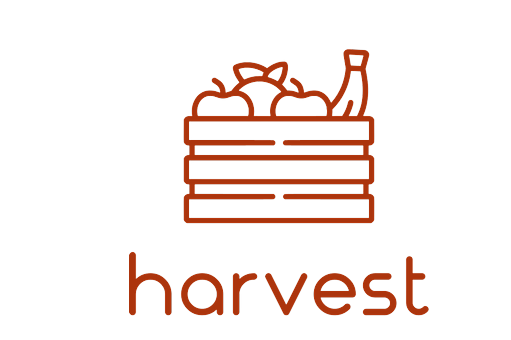
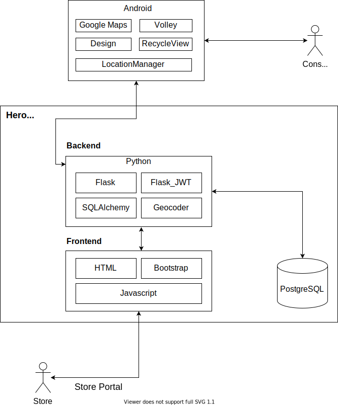

# Harvest
_____

A web app to allow registered grocery store owners to give quality food to anyone using the Android app at a discounted price. This app aims to reduce food waste and aid in decreasing food disaprities in lower income communities.Utilizes GPS so users can locate near by stores and requires no registration for the consumer. The database communication is done within Heroku.

## Website
https://team-um6.herokuapp.com/

## Pitch
https://docs.google.com/presentation/d/1dVvLULELrpLstOM5Cla1WkEIVPW_mu7wcyw3P3vXu-E/edit?usp=sharing

## Conceptual Model

